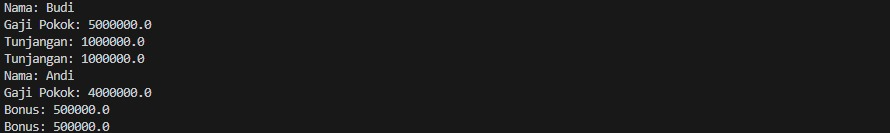

# Latihan-3

## Profil

| Variable        | Isi                         |
| --------------- | --------------------------- |
| **Nama**        | Dendi Permana               |
| **NIM**         | 312310694                   |
| **Kelas**       | TI.23.A.6                   |
| **Mata Kuliah** | Pemrograman Orientasi Objek |

### Latihan

File Pegawai

    public class Pegawai {
    private String nama;
    private double gajiPokok;

    // Setter dan getter untuk nama
    public void setNama(String nama) {
        this.nama = nama;
    }
    public String getNama() {
        return nama;
    }

    // Setter dan getter untuk gaji pokok
    public void setGajiPokok(double gajiPokok) {
        this.gajiPokok = gajiPokok;
    }
    public double getGajiPokok() {
        return gajiPokok;
    }

    // Metode untuk mencetak informasi pegawai
    public void cetakInfo() {
        System.out.println("Nama: " + nama);
        System.out.println("Gaji Pokok: " + gajiPokok);
    }

}

File Manager

    public class Manager extends Pegawai {
    private double tunjangan;

    // Setter dan getter untuk tunjangan
    public void setTunjangan(double tunjangan) {
        this.tunjangan = tunjangan;
    }
    public double getTunjangan() {
        return tunjangan;
    }

    // Metode untuk mencetak informasi manager
    @Override
    public void cetakInfo() {
        super.cetakInfo();
        System.out.println("Tunjangan: " + tunjangan);
    }

    // Metode tambahan untuk mencetak tunjangan
    public void cetakTunjangan() {
        System.out.println("Tunjangan: " + tunjangan);
    }

}

File Progammer

    public class Programmer extends Pegawai {
    private double bonus;

    // Setter dan getter untuk bonus
    public void setBonus(double bonus) {
        this.bonus = bonus;
    }
    public double getBonus() {
        return bonus;
    }

    // Metode untuk mencetak informasi programmer
    @Override
    public void cetakInfo() {
        super.cetakInfo();
        System.out.println("Bonus: " + bonus);
    }

    // Metode tambahan untuk mencetak bonus
    public void cetakBonus() {
        System.out.println("Bonus: " + bonus);
    }

}

Main Java

        public class Main {
        public static void main(String[] args) {
        // Membuat objek Manager
        Manager manager = new Manager();
        manager.setNama("Budi");
        manager.setGajiPokok(5000000);
        manager.setTunjangan(1000000);
        manager.cetakInfo();
        manager.cetakTunjangan();

        // Membuat objek Programmer
        Programmer programmer = new Programmer();
        programmer.setNama("Andi");
        programmer.setGajiPokok(4000000);
        programmer.setBonus(500000);
        programmer.cetakInfo();
        programmer.cetakBonus();
    }

}

### Tampilan Output

